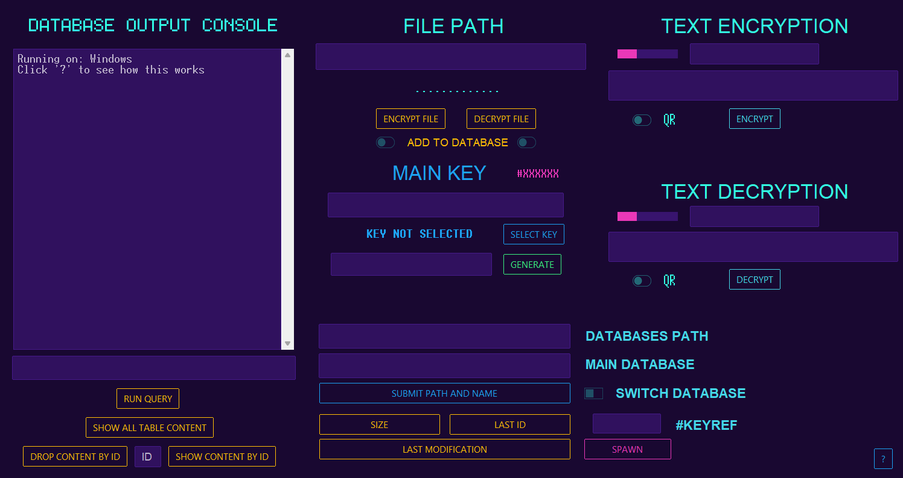

[](https://ashgw.github.io/litecrypt)
[](https://pypi.org/project/litecrypt/)
[](https://pypi.org/project/litecrypt/)


## What is litecrypt ?
Just a library I cooked up for personal use to secure some files, you probably don't need this but if you do, here's an overview:


### Encryption
AES-256 CBC leveraging primitives from the `cryptography` library with added features supporting both fast & very computationally intensive encryption.

### Database Integration
Needed some way to store encrypted files and figure out another way to associate each file with its specific encryption key, which with this setup is automatically done.
### GUI
Made to obviate the need to write code.

## Installation

Starting is a breeze. Just use pip:
```shell
pip install litecrypt
```

## Encryption

```python
from litecrypt import CryptFile, gen_key

key = gen_key()
CryptFile('dataset.csv', key).encrypt()
# Voila! Your file is now called ==> dataset.csv.crypt
```
The encryption process is **blazingly fast** by default, to make it computationally intensive
<details><summary>Do this</summary>

```python
from litecrypt import CryptFile, gen_key

key = gen_key()
CryptFile('anyfile.txt',
          key=key,
          intensive_compute=True,
          iteration_rounds=10000
          ).encrypt()
```
> Running `intensive_compute` with no `iteration_rounds` sets the rounds to 50 (minimum) by default

To decrypt simply run:


```python
from litecrypt import CryptFile

key = 'THE_KEY_YOU_USED'
CryptFile('anyfile.txt.crypt',key=key).decrypt()
```
</details>


Need to protect a message? Bet:
```python
from litecrypt import Crypt, gen_key

key = gen_key()
encrypted = Crypt('any message', key).encrypt()  # can also be a bytes message
print(encrypted)  # Check the return value
```

### Details

**Algorithm:** AES-256 CBC
<br>**Layout:**
````commandline
+-------------+  +--------+  +------------+  +-------------+  +-------------+  +------------------+
|    HMAC     | →|   IV   | →|   Salt     | →|  Pepper     | →| Iterations  | →|     KDF ID     |  →
+-------------+  +--------+  +------------+  +-------------+  +-------------+  +------------------+
                              +------------------+
                              |   Ciphertext    ...
                              +------------------+
````

The main key which is a 32-byte random hex string is provided by `gen_key()` function.

> *The higher the number of iterations, the longer it takes to encrypt/decrypt.*

- **AES Key:** 32-byte random value derived from the main key with the KDF, hashed with SHA256 (1 time or [50..100000] times based on the chosen number of iterations) mixed with the Salt.
- **HMAC Key:** 32-byte random value derived from the main key with  the KDF, hashed with SHA256 (1 time or [50..100000] times based on the chosen number of iterations) mixed with the Pepper.
- **IV:** 16-byte random value.
- **Salt:** 16-byte random value.
- **Pepper:** 16-byte random value.
- **Iterations:** 4-byte fixed value.
- **KDF ID:** 4-byte fixed value used to auto-determine the Key Derivation Function (KDF) to use.
- **Ciphertext:** Variable size.


## Database Integration


<h3>Supported Databases</h3>

Currently, supports MySQL, PostgresSQL and SQLite.

<h3>Example Usage</h3>

```python
from litecrypt import CryptFile, Database, gen_key, gen_ref

files = ["file", "image.png", "notes.txt"]

encryption_key = gen_key()
print(encryption_key) # check it out

# encrypt files
for file in files:
    CryptFile(file,key=encryption_key).encrypt(echo=True)
    # each one of these files ends with .crypt now

same_files_but_with_crypt_extension = ["file.crypt",
                                       "image.png.crypt",
                                       "notes.txt.crypt"]

# Create & connect to the databases (sqlite for now)
main_db = Database('xyz_main.db',echo=True)
keys_db = Database('xyz_keys.db',for_keys=True,echo=True)

# To link up the two databases generate a:
reference_value = gen_ref()
print(reference_value) # check it out

for encrypted_file_name in same_files_but_with_crypt_extension:
    with open(encrypted_file_name,'rb') as f:
        encrypted_file_binary_content = f.read()
        # Insert encrypted content and keys into the databases
        # & link'em up with a ref value
        main_db.insert(encrypted_file_name,
                       encrypted_file_binary_content,
                       ref=reference_value)
        keys_db.insert(encrypted_file_name,
                       encryption_key,
                       ref=reference_value)
```

Confused huh? check the **[Docs](https://ashgw.github.io/litecrypt)**.

##  Or, Simplify with the GUI



<details><summary>Here's how it works</summary>

https://github.com/AshGw/litecrypt/assets/126174609/190b6ab8-3f8a-4656-9525-dbaf5e56db5e

</details>


## Documentation

Check out the **[Docs](https://ashgw.github.io/litecrypt)**.


## License

Litecrypt is open-source project & licensed under the [MIT License](https://github.com/AshGw/litecrypt/blob/main/LICENSE).
