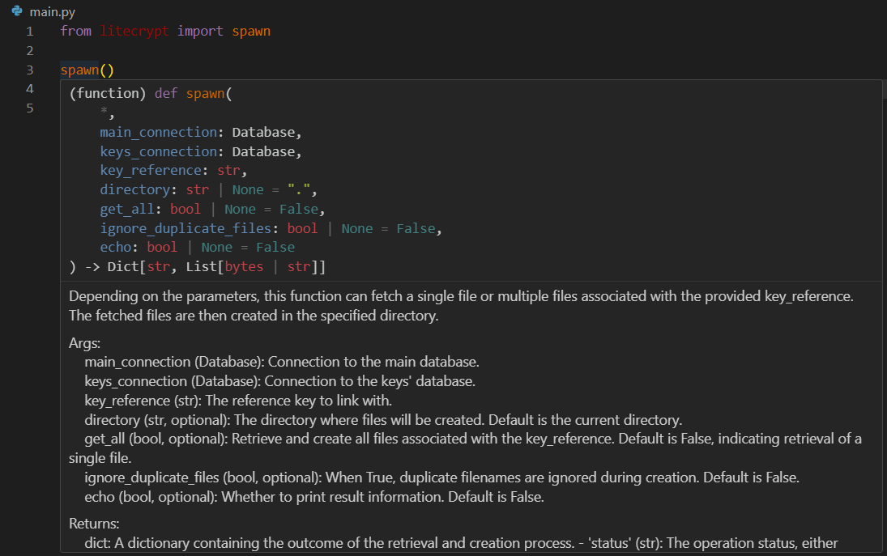

[](https://ashgw.github.io/litecrypt)
[](https://pypi.org/project/litecrypt/)
[](https://pypi.org/project/litecrypt/)


## 🔒 Encryption Made Simple

No more struggling with intricate code – just powerful data security at your fingertips.


## 🔑 Effortlessly Secure Encryption!

No complex encryption steps, encrypting a file is as simple as can be:

```python
from litecrypt import CryptFile, gen_key

key = gen_key()
CryptFile('accounts.csv', key).encrypt()
# Voila! Your file is now called ==> accounts.csv.crypt
```
Need to protect a message?
```python
from litecrypt import Crypt, gen_key

key = gen_key()
encrypted = Crypt('any message', key).encrypt()
print(encrypted)  # Check the return value
```


## 💾 Database Integration

Got valuable data to stash? litecrypt has your back:

Let's say we have 3 files: `file`, `image.png`, and `notes.txt` in a directory called `test`:
```python
files = ['test/file', 'test/image.png', 'test/notes.txt']
```
<details><summary>Click me to make them</summary>

```python
import os
from litecrypt import CryptFile

# Create a directory for testing
os.mkdir('test')

# Create sample files
files = ['test/file', 'test/image.png', 'test/notes.txt']
file_contents = [b'some data', b'binary data of some image', b'some notes']

for file, content in zip(files, file_contents):
    CryptFile.make_file(filename=file, content=content)

# The files now exist in the directory test/
```
</details>
Now we'll leave the files there and take their content, encrypt it, and store it in a database.
<br>You never know when you'll need them.
<details><summary>Collect the content</summary>

```python
file_contents = []
for file in files:
    file_content = CryptFile.get_binary(file)
    file_contents.append(file_content)

```
Now we have a list containing each of these files' content
</details>

</details>
<details><summary>Encrypt each file content</summary>

```python
from litecrypt import Crypt, gen_key

key = gen_key()
encrypted_contents = []
for content in file_contents:
    encrypted_content = Crypt(content, key).encrypt(get_bytes=True)
    encrypted_contents.append(encrypted_content)
```
</details>
Now that we have their content encrypted we need storage

```python
from litecrypt import Database, gen_ref

# Create & connect to the databases
main_db = Database('secure_vault.db')
keys_db = Database('secure_vaultKeys.db')

# Generate a key reference value to link up the two databases with
key_ref = gen_ref()

# Insert encrypted content and keys into databases
for file, encrypted_content in zip(files, encrypted_contents):
    main_db.insert(filename=f'does-not-matter/{file}.crypt', content=encrypted_content, ref=key_ref)
    keys_db.insert(filename=f'does-not-matter/{file}.crypt', content=key, ref=key_ref)
# Add .crypt to indicate they're encrypted
```
Done! Your files are still in `test/`, but you now have encrypted copies of them in the main database.
<br>The keys used for encryption are stored in the keys database.
<br>You can encrypt your keys database too, but for this demo, let it be as is.

**✈️  You're somewhere else now. How do you get the files back?**
<br>Let's simulate this by creating another directory, which we'll call `spawned`:
```python
os.mkdir('spawned')
```
Now, let's retrieve the files:
```python
from litecrypt import spawn

spawned = spawn(main_connection=main_db,
                       keys_connection=keys_db,
                       key_reference=key_ref,
                       directory='spawned',
                       get_all=True,
                       echo=True)
```

That's it! They exist now in the 'spawned/' directory, encrypted though like we put them.
<details><summary>How does it work ?</summary>
Use your editor you'll get a concise explanation on what each function does:




</details>
How about we decrypt them ?

```python
for file, key in zip(spawned['filenames'], spawned['keys']):
    CryptFile(file, key).decrypt(echo=True)
```
Your files are retrieved and decrypted. Check if the files in `test/` match the files in `spawned/`.
<details><summary>Here's the full demo</summary>

```python
import os

from litecrypt import Crypt, CryptFile, Database, gen_key, gen_ref, spawn

# Create a directory for testing
os.mkdir("test")

# Create sample files
files = ["test/file", "test/image.png", "test/notes.txt"]
file_contents = [b"some data", b"binary data of some image", b"some notes"]

for file, content in zip(files, file_contents):
    CryptFile.make_file(filename=file, content=content)

# The files now exist in the directory test/

# Collect each file's content
file_contents = []
for file in files:
    file_content = CryptFile.get_binary(file)
    file_contents.append(file_content)

# Encrypt each file's content one by one
key = gen_key()
encrypted_contents = []
for content in file_contents:
    encrypted_content = Crypt(content, key).encrypt(get_bytes=True)
    encrypted_contents.append(encrypted_content)


# Initialize the main & the associated keys database
main_db = Database("secure_vault.db")
keys_db = Database("secure_vaultKeys.db")  # to hold the keys

# Generate a key reference value to link up the two databases with
key_ref = gen_ref()

# Insert encrypted content and keys into databases
for file, encrypted_content in zip(files, encrypted_contents):
    main_db.insert(
        filename=f"does-not-matter/{file}.crypt", content=encrypted_content, ref=key_ref
    )
    keys_db.insert(filename=f"does-not-matter/{file}.crypt", content=key, ref=key_ref)
# Add .crypt to indicate they're encrypted

# Create another directory
os.mkdir("spawned")

# The files will now pop into existence in this new directory
spawned = spawn(
    main_connection=main_db,
    keys_connection=keys_db,
    key_reference=key_ref,
    directory="spawned",
    get_all=True,
    echo=True,
)

# Decrypt them
for file, key in zip(spawned["filenames"], spawned["keys"]):
    CryptFile(file, key).decrypt(echo=True)
```

</details>

That's it! Try this yourself and see the output in your terminal.
<br>Feeling confused? Read the [docs](https://ashgw.github.io/litecrypt)


## 🚀 Or, Simplify with the GUI


**The place where everything comes together, a user-friendly software that combines the library's power into an easy-to-use application.**


## 🧙‍♂️ Installation Made Easy

Starting is a breeze. If you want to use it as a library, just use pip:

```shell
pip install litecrypt
```

Want the entire repository? Run this command for auto setup:

```shell
curl -sSfL https://raw.githubusercontent.com/AshGw/litecrypt/main/important/setup.sh | bash
```


## 📚 Dive into the Docs

I designed the library's documentation with simplicity in mind. So check out the [Docs](https://ashgw.github.io/litecrypt).


## 🔐 License

Litecrypt is open-source and licensed under the [MIT License](https://github.com/AshGw/litecrypt/blob/main/LICENSE).
