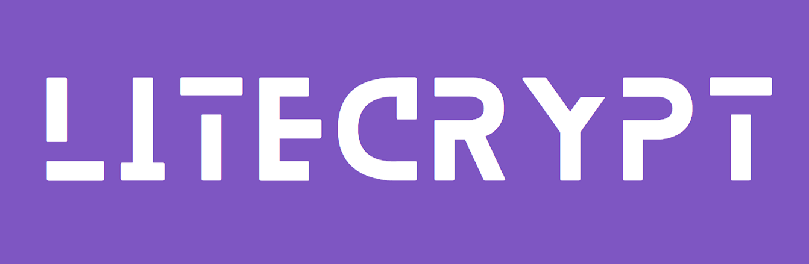
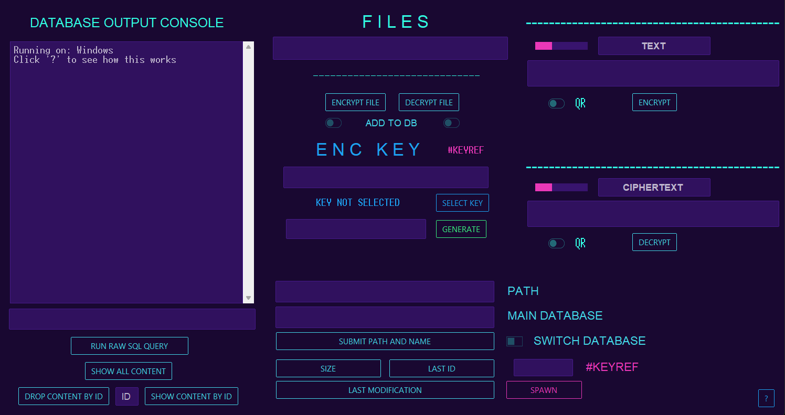

[](https://ashgw.github.io/litecrypt)
[](https://pypi.org/project/litecrypt/)
[](https://pypi.org/project/litecrypt/)

## Overview
So I made this library for personal use to secure some of my personal files & hit the [connect](https://wtf-g-who-u-searching-for-champ.com) from time to time.
It provides support for both fast and highly computationally intensive encryption. Also, it includes a database integration system which facilitates the restoration of files to their original state if necessary, and a GUI is also included to obviate the need to write code.
<br>
The docs can be accessed **[here](https://ashgw.github.io/litecrypt)**, I made it so i don't forget wtf I was yapping about a couple of months ago, probably not so useful for visitors.

## Installation
```shell
pip install litecrypt
```
## Usage

```python
from litecrypt import CryptFile, gen_key

key = gen_key()
CryptFile('file_of_any.type', key).encrypt()
# the file is now called ==> 'file_of_any.type.crypt
```
The encryption process is **blazingly fast** by default, to make it computationally intensive
<details><summary>Do this</summary>

```python
from litecrypt import CryptFile, gen_key

key = gen_key()
CryptFile('anyfile.txt',
          key=key,
          intensive_compute=True,
          iteration_rounds=10000
          ).encrypt()
```
> Running `intensive_compute` with no `iteration_rounds` sets the rounds to 50 (minimum) by default

To decrypt simply run:


```python
from litecrypt import CryptFile

key = 'THE_KEY_YOU_USED'
CryptFile('anyfile.txt.crypt',key=key).decrypt()
```
</details>


For messages:
```python
from litecrypt import Crypt, gen_key

key = gen_key()
encrypted = Crypt('any message', key).encrypt()  # can also be a bytes message
print(encrypted)  # Check the return value
```

### Details
<br>**Algorithm:** AES-256 CBC
<br>**Layout:**
````commandline
+-------------+  +--------+  +------------+  +-------------+  +-------------+  +------------------+
|    HMAC     | →|   IV   | →|   Salt     | →|  Pepper     | →| Iterations  | →|     KDF ID     |  →
+-------------+  +--------+  +------------+  +-------------+  +-------------+  +------------------+
                              +------------------+
                              |   Ciphertext    ...
                              +------------------+
````
AES and HMAC keys, each 32 bytes, are derived from the main key (`gen_key()`) using the chosen KDF with SHA256. Iterations range from 50 to 100,000 the higher they go the more time it takes to compute, that's 4 bytes. IV that's 16, Salt, and Pepper are also 16 byte random values, both mixed with the KDF. The ciphertext size varies, with the crypto process employing PKCS7 padding.

<h3>Supported Databases</h3>

Currently, supports MySQL, PostgresSQL and SQLite.
<br>Check the  **[docs](https://ashgw.github.io/litecrypt)** for more info.

###  GUI



<details><summary>Here's how it works</summary>

https://github.com/AshGw/litecrypt/assets/126174609/190b6ab8-3f8a-4656-9525-dbaf5e56db5e

</details>


## License

Litecrypt is open-source project & licensed under the [MIT License](https://github.com/AshGw/litecrypt/blob/main/LICENSE).
